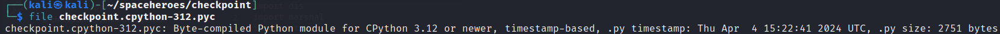
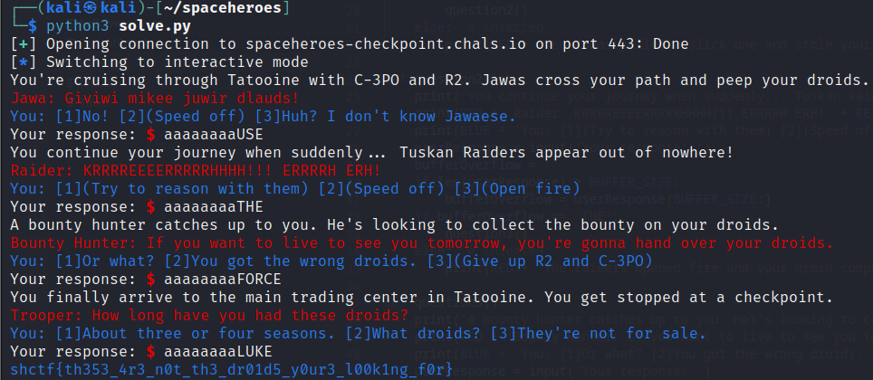

# Checkpoint

## Overview

Points: 449

Category: RE

## Approach

The binary we were given was atypical, it was compiled python bytecode.



Attempts at loading the file into standard decompilers/disassemblers did not end well as none of them were able to load the file properly. Researching online yielded a few open-source decompilers for python bytecode, however much of these projects only supported up to python 3.8, our target file was compiled with python 3.12.

Eventually we came across an article that explained how to grab the 'assembly' of the `.pyc` file. 

*https://betterprogramming.pub/analysis-of-compiled-python-files-629d8adbe787*

First python 3.12 was downloaded to the workstation. Next we followed the guide where we used the following script to decompile the file:

```py
import sys
import dis, marshal
pyc_path = sys.argv[1]
with open(pyc_path, 'rb') as f:
    # First 16 bytes comprise the pyc header (python 3.6+), else 8 bytes.
    pyc_header = f.read(16)
    code_obj = marshal.load(f) # Suite to code object

dis.dis(code_obj)
```

The output from this code wasn't pretty.

```
  0           0 RESUME                   0

  1           2 LOAD_CONST               0 ('\x1b[91m')
              4 STORE_NAME               0 (RED)

  2           6 LOAD_CONST               1 ('\x1b[94m')
              8 STORE_NAME               1 (BLUE)

  3          10 LOAD_CONST               2 ('\x1b[0m')
             12 STORE_NAME               2 (RESET)

  4          14 LOAD_CONST               3 (8)
             16 STORE_NAME               3 (BUFFER_SIZE)

  6          18 LOAD_CONST               4 (<code object question1 at 0x000001C060A88D50, file "C:\Users\jorda\OneDrive\Documents\School\CSE4860\RE\src\checkpoint.py", line 6>)
             20 MAKE_FUNCTION            0
             22 STORE_NAME               4 (question1)

 20          24 LOAD_CONST               5 (<code object question2 at 0x000001C060A894D0, file "C:\Users\jorda\OneDrive\Documents\School\CSE4860\RE\src\checkpoint.py", line 20>)
             26 MAKE_FUNCTION            0
             28 STORE_NAME               5 (question2)

 34          30 LOAD_CONST               6 (<code object question3 at 0x000001C060A89A70, file "C:\Users\jorda\OneDrive\Documents\School\CSE4860\RE\src\checkpoint.py", line 34>)
             32 MAKE_FUNCTION            0
             34 STORE_NAME               6 (question3)

 48          36 LOAD_CONST               7 (<code object question4 at 0x000001C060A89C50, file "C:\Users\jorda\OneDrive\Documents\School\CSE4860\RE\src\checkpoint.py", line 48>)
             38 MAKE_FUNCTION            0
             40 STORE_NAME               7 (question4)

 62          42 LOAD_CONST               8 (<code object printFlag at 0x000001C060D86420, file "C:\Users\jorda\OneDrive\Documents\School\CSE4860\RE\src\checkpoint.py", line 62>)
             44 MAKE_FUNCTION            0
             46 STORE_NAME               8 (printFlag)

 69          48 PUSH_NULL
             50 LOAD_NAME                4 (question1)
             52 CALL                     0
             60 POP_TOP
             62 RETURN_CONST             9 (None)

Disassembly of <code object question1 at 0x000001C060A88D50, file "C:\Users\jorda\OneDrive\Documents\School\CSE4860\RE\src\checkpoint.py", line 6>:
  6           0 RESUME                   0

  7           2 LOAD_GLOBAL              1 (NULL + print)
             12 LOAD_CONST               1 ("You're cruising through Tatooine with C-3PO and R2. Jawas cross your path and peep your droids.")
             14 CALL                     1
             22 POP_TOP

  8          24 LOAD_GLOBAL              1 (NULL + print)
             34 LOAD_GLOBAL              2 (RED)
             44 LOAD_CONST               2 ('Jawa: Giviwi mikee juwir dlauds!')
             46 BINARY_OP                0 (+)
             50 LOAD_GLOBAL              4 (RESET)
             60 BINARY_OP                0 (+)
             64 CALL                     1
             72 POP_TOP

  9          74 LOAD_GLOBAL              1 (NULL + print)
             84 LOAD_GLOBAL              6 (BLUE)
             94 LOAD_CONST               3 ("You: [1]No! [2](Speed off) [3]Huh? I don't know Jawaese.")
             96 BINARY_OP                0 (+)
            100 LOAD_GLOBAL              4 (RESET)
            110 BINARY_OP                0 (+)
            114 CALL                     1
            122 POP_TOP

 10         124 LOAD_GLOBAL              9 (NULL + input)
            134 LOAD_CONST               4 ('Your response: ')
            136 CALL                     1
            144 STORE_FAST               0 (userResponse)

 12         146 LOAD_CONST               5 ('')
            148 STORE_FAST               1 (bufferOverflow)

 13         150 LOAD_GLOBAL             11 (NULL + len)
            160 LOAD_FAST                0 (userResponse)
            162 CALL                     1
            170 LOAD_GLOBAL             12 (BUFFER_SIZE)
            180 COMPARE_OP              68 (>)
            184 POP_JUMP_IF_FALSE        9 (to 204)

 14         186 LOAD_FAST                0 (userResponse)
            188 LOAD_GLOBAL             12 (BUFFER_SIZE)
            198 LOAD_CONST               0 (None)
            200 BINARY_SLICE
            202 STORE_FAST               1 (bufferOverflow)

 15     >>  204 LOAD_FAST                1 (bufferOverflow)
            206 LOAD_CONST               6 ('USE')
            208 COMPARE_OP              40 (==)
            212 POP_JUMP_IF_FALSE       11 (to 236)

 16         214 LOAD_GLOBAL             15 (NULL + question2)
            224 CALL                     0
            232 POP_TOP
            234 RETURN_CONST             0 (None)

 18     >>  236 LOAD_GLOBAL              1 (NULL + print)
            246 LOAD_GLOBAL              2 (RED)
            256 LOAD_CONST               7 ('The Jawas pulled a slick one and stole your droids successfully.')
            258 BINARY_OP                0 (+)
            262 LOAD_GLOBAL              4 (RESET)
            272 BINARY_OP                0 (+)
            276 CALL                     1
            284 POP_TOP
            286 RETURN_CONST             0 (None)

Disassembly of <code object question2 at 0x000001C060A894D0, file "C:\Users\jorda\OneDrive\Documents\School\CSE4860\RE\src\checkpoint.py", line 20>:
 20           0 RESUME                   0

 21           2 LOAD_GLOBAL              1 (NULL + print)
             12 LOAD_CONST               1 ('You continue your journey when suddenly... Tuskan Raiders appear out of nowhere!')
             14 CALL                     1
             22 POP_TOP

 22          24 LOAD_GLOBAL              1 (NULL + print)
             34 LOAD_GLOBAL              2 (RED)
             44 LOAD_CONST               2 ('Raider: KRRRREEEERRRRRHHHH!!! ERRRRH ERH!')
             46 BINARY_OP                0 (+)
             50 LOAD_GLOBAL              4 (RESET)
             60 BINARY_OP                0 (+)
             64 CALL                     1
             72 POP_TOP

 23          74 LOAD_GLOBAL              1 (NULL + print)
             84 LOAD_GLOBAL              6 (BLUE)
             94 LOAD_CONST               3 ('You: [1](Try to reason with them) [2](Speed off) [3](Open fire)')
             96 BINARY_OP                0 (+)
            100 LOAD_GLOBAL              4 (RESET)
            110 BINARY_OP                0 (+)
            114 CALL                     1
            122 POP_TOP

 24         124 LOAD_GLOBAL              9 (NULL + input)
            134 LOAD_CONST               4 ('Your response: ')
            136 CALL                     1
            144 STORE_FAST               0 (userResponse)

 26         146 LOAD_CONST               5 ('')
            148 STORE_FAST               1 (bufferOverflow)

 27         150 LOAD_GLOBAL             11 (NULL + len)
            160 LOAD_FAST                0 (userResponse)
            162 CALL                     1
            170 LOAD_GLOBAL             12 (BUFFER_SIZE)
            180 COMPARE_OP              68 (>)
            184 POP_JUMP_IF_FALSE        9 (to 204)

 28         186 LOAD_FAST                0 (userResponse)
            188 LOAD_GLOBAL             12 (BUFFER_SIZE)
            198 LOAD_CONST               0 (None)
            200 BINARY_SLICE
            202 STORE_FAST               1 (bufferOverflow)

 29     >>  204 LOAD_FAST                1 (bufferOverflow)
            206 LOAD_CONST               6 ('THE')
            208 COMPARE_OP              40 (==)
            212 POP_JUMP_IF_FALSE       11 (to 236)

 30         214 LOAD_GLOBAL             15 (NULL + question3)
            224 CALL                     0
            232 POP_TOP
            234 RETURN_CONST             0 (None)

 32     >>  236 LOAD_GLOBAL              1 (NULL + print)
            246 LOAD_GLOBAL              2 (RED)
            256 LOAD_CONST               7 ('The raiders opened fire and your droid companions did not make it.')
            258 BINARY_OP                0 (+)
            262 LOAD_GLOBAL              4 (RESET)
            272 BINARY_OP                0 (+)
            276 CALL                     1
            284 POP_TOP
            286 RETURN_CONST             0 (None)

Disassembly of <code object question3 at 0x000001C060A89A70, file "C:\Users\jorda\OneDrive\Documents\School\CSE4860\RE\src\checkpoint.py", line 34>:
 34           0 RESUME                   0

 35           2 LOAD_GLOBAL              1 (NULL + print)
             12 LOAD_CONST               1 ("A bounty hunter catches up to you. He's looking to collect the bounty on your droids.")
             14 CALL                     1
             22 POP_TOP

 36          24 LOAD_GLOBAL              1 (NULL + print)
             34 LOAD_GLOBAL              2 (RED)
             44 LOAD_CONST               2 ("Bounty Hunter: If you want to live to see you tomorrow, you're gonna hand over your droids.")
             46 BINARY_OP                0 (+)
             50 LOAD_GLOBAL              4 (RESET)
             60 BINARY_OP                0 (+)
             64 CALL                     1
             72 POP_TOP

 37          74 LOAD_GLOBAL              1 (NULL + print)
             84 LOAD_GLOBAL              6 (BLUE)
             94 LOAD_CONST               3 ('You: [1]Or what? [2]You got the wrong droids. [3](Give up R2 and C-3PO)')
             96 BINARY_OP                0 (+)
            100 LOAD_GLOBAL              4 (RESET)
            110 BINARY_OP                0 (+)
            114 CALL                     1
            122 POP_TOP

 38         124 LOAD_GLOBAL              9 (NULL + input)
            134 LOAD_CONST               4 ('Your response: ')
            136 CALL                     1
            144 STORE_FAST               0 (userResponse)

 40         146 LOAD_CONST               5 ('')
            148 STORE_FAST               1 (bufferOverflow)

 41         150 LOAD_GLOBAL             11 (NULL + len)
            160 LOAD_FAST                0 (userResponse)
            162 CALL                     1
            170 LOAD_GLOBAL             12 (BUFFER_SIZE)
            180 COMPARE_OP              68 (>)
            184 POP_JUMP_IF_FALSE        9 (to 204)

 42         186 LOAD_FAST                0 (userResponse)
            188 LOAD_GLOBAL             12 (BUFFER_SIZE)
            198 LOAD_CONST               0 (None)
            200 BINARY_SLICE
            202 STORE_FAST               1 (bufferOverflow)

 43     >>  204 LOAD_FAST                1 (bufferOverflow)
            206 LOAD_CONST               6 ('FORCE')
            208 COMPARE_OP              40 (==)
            212 POP_JUMP_IF_FALSE       11 (to 236)

 44         214 LOAD_GLOBAL             15 (NULL + question4)
            224 CALL                     0
            232 POP_TOP
            234 RETURN_CONST             0 (None)

 46     >>  236 LOAD_GLOBAL              1 (NULL + print)
            246 LOAD_GLOBAL              2 (RED)
            256 LOAD_CONST               7 ('The bounty hunter puts you six feet under and steals your droids.')
            258 BINARY_OP                0 (+)
            262 LOAD_GLOBAL              4 (RESET)
            272 BINARY_OP                0 (+)
            276 CALL                     1
            284 POP_TOP
            286 RETURN_CONST             0 (None)

Disassembly of <code object question4 at 0x000001C060A89C50, file "C:\Users\jorda\OneDrive\Documents\School\CSE4860\RE\src\checkpoint.py", line 48>:
 48           0 RESUME                   0

 49           2 LOAD_GLOBAL              1 (NULL + print)
             12 LOAD_CONST               1 ('You finally arrive to the main trading center in Tatooine. You get stopped at a checkpoint.')
             14 CALL                     1
             22 POP_TOP

 50          24 LOAD_GLOBAL              1 (NULL + print)
             34 LOAD_GLOBAL              2 (RED)
             44 LOAD_CONST               2 ('Trooper: How long have you had these droids?')
             46 BINARY_OP                0 (+)
             50 LOAD_GLOBAL              4 (RESET)
             60 BINARY_OP                0 (+)
             64 CALL                     1
             72 POP_TOP

 51          74 LOAD_GLOBAL              1 (NULL + print)
             84 LOAD_GLOBAL              6 (BLUE)
             94 LOAD_CONST               3 ("You: [1]About three or four seasons. [2]What droids? [3]They're not for sale.")
             96 BINARY_OP                0 (+)
            100 LOAD_GLOBAL              4 (RESET)
            110 BINARY_OP                0 (+)
            114 CALL                     1
            122 POP_TOP

 52         124 LOAD_GLOBAL              9 (NULL + input)
            134 LOAD_CONST               4 ('Your response: ')
            136 CALL                     1
            144 STORE_FAST               0 (userResponse)

 54         146 LOAD_CONST               5 ('')
            148 STORE_FAST               1 (bufferOverflow)

 55         150 LOAD_GLOBAL             11 (NULL + len)
            160 LOAD_FAST                0 (userResponse)
            162 CALL                     1
            170 LOAD_GLOBAL             12 (BUFFER_SIZE)
            180 COMPARE_OP              68 (>)
            184 POP_JUMP_IF_FALSE        9 (to 204)

 56         186 LOAD_FAST                0 (userResponse)
            188 LOAD_GLOBAL             12 (BUFFER_SIZE)
            198 LOAD_CONST               0 (None)
            200 BINARY_SLICE
            202 STORE_FAST               1 (bufferOverflow)

 57     >>  204 LOAD_FAST                1 (bufferOverflow)
            206 LOAD_CONST               6 ('LUKE')
            208 COMPARE_OP              40 (==)
            212 POP_JUMP_IF_FALSE       11 (to 236)

 58         214 LOAD_GLOBAL             15 (NULL + printFlag)
            224 CALL                     0
            232 POP_TOP
            234 RETURN_CONST             0 (None)

 60     >>  236 LOAD_GLOBAL              1 (NULL + print)
            246 LOAD_GLOBAL              2 (RED)
            256 LOAD_CONST               7 ('The troopers opened fire and your droid companions did not make it.')
            258 BINARY_OP                0 (+)
            262 LOAD_GLOBAL              4 (RESET)
            272 BINARY_OP                0 (+)
            276 CALL                     1
            284 POP_TOP
            286 RETURN_CONST             0 (None)

Disassembly of <code object printFlag at 0x000001C060D86420, file "C:\Users\jorda\OneDrive\Documents\School\CSE4860\RE\src\checkpoint.py", line 62>:
 62           0 RESUME                   0

 63           2 NOP

 64           4 LOAD_GLOBAL              1 (NULL + open)
             14 LOAD_CONST               1 ('/flag/flag.txt')
             16 LOAD_CONST               2 ('r')
             18 CALL                     2
             26 BEFORE_WITH
             28 STORE_FAST               0 (file)

 65          30 LOAD_GLOBAL              3 (NULL + print)
             40 LOAD_GLOBAL              4 (BLUE)
             50 LOAD_FAST                0 (file)
             52 LOAD_ATTR                7 (NULL|self + read)
             72 CALL                     0
             80 BINARY_OP                0 (+)
             84 LOAD_GLOBAL              8 (RESET)
             94 BINARY_OP                0 (+)
             98 CALL                     1
            106 POP_TOP

 64         108 LOAD_CONST               0 (None)
            110 LOAD_CONST               0 (None)
            112 LOAD_CONST               0 (None)
            114 CALL                     2
            122 POP_TOP
            124 RETURN_CONST             0 (None)
        >>  126 PUSH_EXC_INFO
            128 WITH_EXCEPT_START
            130 POP_JUMP_IF_TRUE         1 (to 134)
            132 RERAISE                  2
        >>  134 POP_TOP
            136 POP_EXCEPT
            138 POP_TOP
            140 POP_TOP
            142 RETURN_CONST             0 (None)
        >>  144 COPY                     3
            146 POP_EXCEPT
            148 RERAISE                  1
        >>  150 PUSH_EXC_INFO

 66         152 LOAD_GLOBAL             10 (FileNotFoundError)
            162 CHECK_EXC_MATCH
            164 POP_JUMP_IF_FALSE       14 (to 194)
            166 POP_TOP

 67         168 LOAD_GLOBAL              3 (NULL + print)
            178 LOAD_CONST               3 ('Error: flag file not found.')
            180 CALL                     1
            188 POP_TOP
            190 POP_EXCEPT
            192 RETURN_CONST             0 (None)

 66     >>  194 RERAISE                  0
        >>  196 COPY                     3
            198 POP_EXCEPT
            200 RERAISE                  1
ExceptionTable:
  4 to 26 -> 150 [0]
  28 to 106 -> 126 [1] lasti
  108 to 122 -> 150 [0]
  126 to 134 -> 144 [3] lasti
  136 to 140 -> 150 [0]
  144 to 148 -> 150 [0]
  150 to 188 -> 196 [1] lasti
  194 to 194 -> 196 [1] lasti

```

There's a lot here but from this we were immediately able to decipher that:

* There are 5 functions
  * question1
  * question2
  * question3
  * question4
  * printFlag
* Some constants are being loaded (biggest one is that `BUFFER_SIZE` is set to **8**)

*We confirmed that the strings present in the disassembly matched what was found when we ran `strings` on the file.*

Now here came the fun part, trying to convert this into something more 'readable'. We weren't familiar with the opcodes present, so a good chunk of time was spent reviewing them in the documentation

*https://docs.python.org/3/library/dis.html*

After some time, the following python script was written based on the opcodes from the disassembly:

```py
RED = ''
BLUE = ''
RESET = ''
BUFFER_SIZE = 8

def question1():
    print("You're cruising through Tatooine with C-3PO and R2. Jawas cross your path and peep your droids.")
    print(RED + 'Jawa: Giviwi mikee juwir dlauds!' + RESET)
    print(BLUE + 'You: [1]No! [2](Speed off) [3]Huh? I don\'t know Jawaese.' + RESET)
    userResponse = input('Your response: ')
    bufferOverflow = ''
    if len(userResponse) > BUFFER_SIZE:
        bufferOverflow = userResponse[BUFFER_SIZE:]
    if bufferOverflow == 'USE':
        question2()
    else:
        print(RED + 'The Jawas pulled a slick one and stole your droids successfully.' + RESET)

def question2():
    print('You continue your journey when suddenly... Tuskan Raiders appear out of nowhere!')
    print(RED + 'Raider: KRRRREEEERRRRRHHHH!!! ERRRRH ERH!' + RESET)
    print(BLUE + 'You: [1](Try to reason with them) [2](Speed off) [3](Open fire)' + RESET)
    userResponse = input('Your response: ')
    bufferOverflow = ''
    if len(userResponse) > BUFFER_SIZE:
        bufferOverflow = userResponse[BUFFER_SIZE:]
    if bufferOverflow == 'THE':
        question3()
    else:
        print(RED + 'The raiders opened fire and your droid companions did not make it.' + RESET)

def question3():
    print("A bounty hunter catches up to you. He's looking to collect the bounty on your droids.")
    print(RED + "Bounty Hunter: If you want to live to see you tomorrow, you're gonna hand over your droids." + RESET)
    print(BLUE + 'You: [1]Or what? [2]You got the wrong droids. [3](Give up R2 and C-3PO)' + RESET)
    userResponse = input('Your response: ')
    bufferOverflow = ''
    if len(userResponse) > BUFFER_SIZE:
        bufferOverflow = userResponse[BUFFER_SIZE:]
    if bufferOverflow == 'FORCE':
        question4()
    else:
        print(RED + 'The bounty hunter puts you six feet under and steals your droids.' + RESET)

def question4():
    print('You finally arrive to the main trading center in Tatooine. You get stopped at a checkpoint.')
    print(RED + 'Trooper: How long have you had these droids?' + RESET)
    print(BLUE + "You: [1]About three or four seasons. [2]What droids? [3]They're not for sale." + RESET)
    userResponse = input('Your response: ')
    bufferOverflow = ''
    if len(userResponse) > BUFFER_SIZE:
        bufferOverflow = userResponse[BUFFER_SIZE:]
    if bufferOverflow == 'LUKE':
        printFlag()
    else:
        print(RED + 'The troopers opened fire and your droid companions did not make it.' + RESET)

def printFlag():
    try:
        with open('/flag/flag.txt', 'r') as file:
            print(BLUE + file.read() + RESET)
    except FileNotFoundError:
        print('Error: flag file not found.')
question1()
```

With the script now readbable, the path to the flag was clear. We simply needed to pass the following values: `USE`, `THE`, `FORCE`, and `LUKE` to questions 1, 2, 3 and 4 respectively with a padding of 8 characters before each value (i.e. `00000000USE`) to get the flag. 



## Flag

shctf{th353_4r3_n0t_th3_dr01d5_y0ur3_l00k1ng_f0r} 

## NOTE

solve.py is literally just connecting to the challenge in interactive mode with pwntools. We couldn't get it to work automatically with the script for some reason.

```py
#!/usr/bin/python3
from pwn import *

io = remote("spaceheroes-checkpoint.chals.io", 443, ssl=True, sni="spaceheroes-checkpoint.chals.io")


io.recvuntil(b"Your response: ")
io.sendline(b"00000000USE")

io.recvuntil(b"Your response: ")
io.sendline(b"00000000THE")

io.recvuntil(b"Your response: ")
io.sendline(b"00000000FORCE")

io.recvuntil(b"Your response: ")
io.sendline(b"00000000LUKE")

io.interactive()
```
